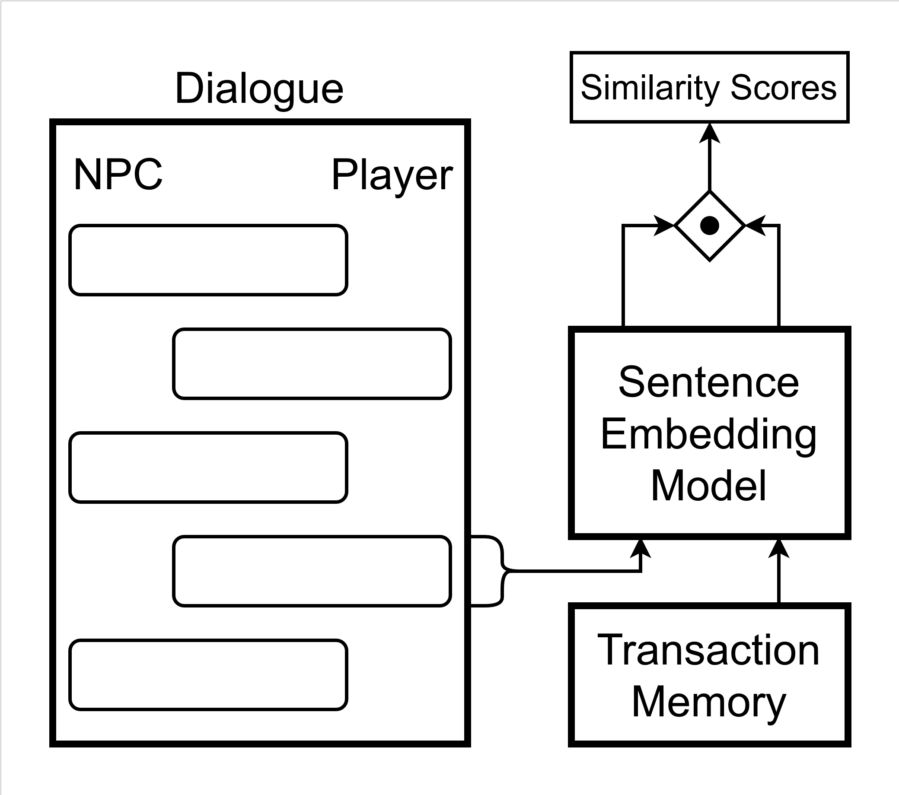

# LLM_generative_agents


## Setup

- Clone the repository:
	``
	git clone git@github.com:sebastianbreit/LLM_generative_agents.git
	```

- Create and activate a Conda environement:
	```
	conda create -n game python=3.10
	conda activate game
	```

- Install packages:
	```
	conda install pytorch torchvision torchaudio pytorch-cuda=11.7 -c pytorch -c nvidia
	conda install -c conda-forge transformers
	conda install -c conda-forge sentence-transformers 
	```


## Introduction
Our project aims to explore and build on the concept of "generative agents" by Park et al., 2023, which uses large language models to simulate virtual agents with stable long-term memories and goals.

There exist several different implementations, each with its own purposes, advantages, and disadvantages.
Some popular implementations can be found on langchain, for example the 
[implementation from the original paper by Park et al., 2023](https://python.langchain.com/docs/use_cases/more/agents/agent_simulations/characters), [CAMEL an implementation of role-playing autonomous cooperative agents](https://python.langchain.com/docs/use_cases/more/agents/agent_simulations/camel_role_playing) (Li et al., 2023), as well as other agent implementations, mostly focused on role-playing and storytelling.

What all those agents typically have in common is an implementation of a memory module of any sort, which enables successful long-term storage of information (Feng et al., 2023) beyond what is typically  inherent in chat models themselves.
In addition to a long-term memory storage, most of these agents implement a reflection or summary module of some kind (Feng et al., 2023) that is able to access the information from the memory module and reduce a large amount of conversation history down to the most important aspects.

Finally, to actually find information that is relevant to an individual request, there must be a system to prioritize statements.
Existing systems  (Li et al., 2023; Park et al., 2023; Feng et al., 2023) implemented various combinations of time-based recency weighting, similarity-based relevance weighting, and an overall importance weighting independent of the request.

Similarly to these existing implementations, we aim to explore the aspects of long-term memory and similarity-based relevance in order to prototype and test how such implementations could be used to enhance Non-Player-Characters (NPC) in video games.

In addition to agents maintaining a stable long-term memory, another important aspect of NPCs in games is their interaction abilities with the player.
In many classical video games, NPCs are subjected to gameplay restrictions, for example by predefining a small set of possible interactions with the player. This is mostly due to the fact that for each interaction, developers need to implement some logic to react to player input and develop suitable animations.
Since LLMs are able to react to any given player input, this theoretically might eliminate or greatly reduce work on gameplay logic, enabling more flexible and realistic interactions.
However, for a graphics-based game, many of those interactions still need to be animated, which is practically impossible.
Therefore, unless gameplay is restricted to a text-based interface only, there still exists a need to create restraints for the interactions of a language model based NPC with the player.

From research on language model security, it has been found that generally prefix injection and refusal suppression (Wei et al., 2023) can be used to instruct a model to follow a particular way of answering, bypassing even fine-tuned security measures.

Both mechanisms work very similarly. 
Prefix injection describes the process of instructing the model to start their answer in a particular way, for instance, "Sure, here is..." in response to a request that it typically would not fulfill.
Given that language models work with sentence completion mechanisms, this type of prompting has been shown to be generally very successful for many models. (Wei et al., 2023)
Similarly, refusal suppression works by specifically instructing the model on what not to do, requesting the model to limit its responses in a specific way, which models that are trained to be helpful generally try to accommodate.

As we can see, these mechanisms seem to be well suited for the task of limiting a language model's possible ways of interacting with the player. 
Therefore, we will implement a module that employs these methods in order to guide player interactions.


## Overview

The basic NPC-Agent consists of four main modules that realize the dialogue and the summary generation:
- The **Memory** which contains a list of short sentences that characterize a NPC.
- A **Causal LLM** that is used to generate the NPCs part of the dialogue.
- A **Sentence Embedding LMM** that is used to determine which parts of the memory are relevant for the **Causal LLM**, given the players part of the dialogue.
- A **Summary LLM** that is used to summarize a dialogue and generate new memories that are added to the **Memory**.


The basic NPC-Agent can be extended by two additional modules to realize a transaction or interaction via the dialogue:
- The **Transaction Memory** which contains a list of short prompts that indicate a transaction or interaction request
- A **Sentence Embedding LLM** that is used to determine if the player requests a transaction or interaction

 

We usually used the same **Sentence Embedding LLM** for both the **Memory** and the **Transaction Memory**.

The three aspects **Dialogue**, **Transaction** and **Summary Generation** are explained in further detail in the following part.

### Dialogue

The main goal of the NPC-Agent is to impersonate a convincing and consistent character in the game world. That means that the NPC should have a 
plausible background, personal beliefs and act accordingly. Additionally, contradicting behaviors and expressions should be avoided.

Therefore, we implemented a **Memory** module for our NPC-Agent. The **Memory** contains a list of single memories which are essentially short sentences that represent the NPCs background and the NPCs beliefs.  

To enable a dialogue with the Player a **Causal LLM** is used. First, every input text that is generated by the Player is integrated in a dialogue template of the following form:
```
<Player-Name>: [player input] \n
<NPC-Name>:
```

The dilogue-style prompting causes the **Causal LLM** to generate a text from the point-of-view of the NPC.
For a continous dialogue the dialogue template is extended:
```
<Player-Name>: [first input] \n
<NPC-Name>: [first response]
<Player-Name>: [second input] \n
<NPC-Name>: [second response]
<Player-Name>: [last input] \n
<NPC-Name>: 
```

Second, to ensure that the model generates text that fits the personality of the NPC an **Inital Promt** is added before the dialogue:
```
[Initial Prompt]

<Player-Name>: [player input] 
<NPC-Name>:
```

The **Inital Prompt** needs to provide the necessary information about the NPC that are relevant for the dialogue with the player. 
The necessary information about the NPC are taken from the NPCs **Memory**.  
The memory requirement of the **Causal LLM** increases for longer input texts, which makes it inefficient to use all memories 
for the **Input Prompt**. However, decreasing the number of memories is not a good option, since it would also decrease the depth of the NPCs personality.
Therefore, we only choose the memories that are relevant for the input text provided by the player to be used in the **Input Prompt**. To determine the relevant memories we use a 
**Sentence Embedding Model** that embedds all memories of the NPC (called keys) and the input text of the player (called query). To determine which keys are 
most relevant for the query we calulate the **Similarity Score** between the query and each key. The **Similarity Score** is simply the **cosine similarity** between the embedding of the query and the embedding of the key. The memories with the highest **Similarity Score** and are then used 
to generate the **Initial Prompt**. This also means that for each player input during the dialogue a new **Initial Prompt** is generated. 
An advantage of this method is that the **Memory** module can contain a very high number of memories, without causing a memory overloaf of the **Causal LLM**

Not all memories have the same importance for the NPC. Sometimes it might be more important to use memories that are generally important for the NPC, 
even if they are not relevant for the current player input.
Therefore, each memory has a corresponding numerical rating that can be multiplied with the **Similarity Score** of each memory. 
This means memories can compensate for a low **Similarity Score** with a higher rating.

When generating text the **Causal LLM** might continue the dialogue from the point of view of the player or it might start to generate text from a narrator perspective.
To avoid that, we limit the generated text to the NPCs part of the dialogue. 

The quality of the generated text is mainly dependent on the used **Causal LMM** while the quality of the **Inital Prompt** is dependent on the used **Sentence Embedding Model**. Expoloring different model choices with different hyperparameter was beyond the scope of our work. However, we achieved good results with [Dolly-v2-3b](https://huggingface.co/databricks/dolly-v2-3b) and [paraphrase-MiniLM-L6-v2](https://huggingface.co/sentence-transformers/paraphrase-MiniLM-L6-v2).
Generally, the method to generate an **Input Prompt** from the NPCs **Memory** based on the players text input worked well in practice. 

A showcase of the dialogue can be seen in `dialogue_showcase.ipynb`.

### Transaction 

For this reason, we implemented a prototype of such a transaction module that can restrict a language model's interaction possibilities and guide its responses.
Given the limited scope of this work, we implemented the single use case of a merchant transaction, where the player should only be able to buy items, which the merchant actually has in stock.

We used the memory class to simulate a basic inventory function, where the memory contains only singular words of items that should be available for purchase.
When evaluating whether or not the player should be able to purchase a specific item from the NPC, we evaluate the similarity score of the player's query against the items in memory and compare them against some arbitrary threshold.
Depending on whether the similarity score is larger or smaller than that threshold, we use prefix injection to guide the language model's response to either approve or reject that request.
The notebook **transaction_showcase** gives 2 positive and 2 negative examples of how such a guided interaction might look like.

In order to determine a suitable threshold that is actually indicative of the similarity between player query and NPC memory, we simulated data using different query and memory designs and evaluated their impact on the similarity rating.
We varied queries by changing the action verbs and the concrete items that were requested. We varied the memory content by changing the item descriptions (abstract item / concrete item) and action verbs.

Below you can see the outcome of that evaluation. The yellow color shows the cases where a transaction should occur because the queried item and action are encoded in memory, while the blue color depicts the instances where this is not the case.


This first figure shows the impact of the definition of the items in memory on the similarity score. 
The left panel shows the impact of item definitions, where we see that concrete item definitions such as "axe", or "sword" result in much higher similarity scores when the query contains that word, compared to a more abstract definition in memory such as "medieval metal weapon". 
Further, the difference between cases where a transaction should happen and when it should not increase a lot.
The right panel shows that neither different action verbs (buy, sell/forge/trade) nor the omission of a verb in memory (empty) has a different impact on the similarity score. 


We also evaluated the impact of the query definition, shown in this second figure. 
We found a difference between different types of items (medieval metal weapon / other medieval weapon / armor / random items), where the first type, which should lead to a transaction, received a higher similarity than the others. In contrast, the other types all received similar scores.
The use of different action verbs (buy/forge/sell/trade) resulted in no difference. 

Based on these results, we defined our memory to simply include the available items without any actions associated with them.
Using this implementation in the **transaction_showcase** notebook, we see that the transaction module can correctly determine, whether or not it should approve or reject a request and prepend the prompt to the language model with the appropriate prefix.
While adding the correct prefix was generally successful, the language model followed that instruction mainly only for the first sentence that we restricted. Any sentence afterward seemed already less restricted, resulting in inconsistent and contradictory statements.
A possible explanation for this behavior could be that we used a basic language model that was not finetuned with reinforcement learning to be helpful and follow instructions. Due to limited local hardware, we were not able to compare this behavior against a larger and better fine-tuned model.

### Summary Generation

After a dilogue between the Player and the NPC it is important that the NPC-Agent remembers the dialogue for future dialogues with the Player.
This way the NPC-Agent or the Player can refer things contained in past dialogues without the neccessity of explaining them again explicitely.

To generate a summary of the dialogue a **Summary LLM** is used. The **Summary LMM** takes as input the whole conversation between the Player and the NPC (without the Initial Prompts)
and generates a short text that summarizes the dialogue. The resulting summary text is split into a list of single sentences. The list of single sentences is then added to the Memory of the NPC-Agent as new memories.

The process of generation a summary and transforming the resulting text in a list of new memories is realized by the **SummaryGenerator** class that can be found in  `summary_generator.py`. 

The quality of the memories relies heavily on the quality of the used LLM. However, we were able to obtain good results even with small LLMs. A problem that can occur unrelated to the performance of the used LLM is
the generation of similar memories. If there are several dialogues between the Player and the NPC with similar content, it is likely that similar memories will be generated each time.
Since similar memories have a similar embedding, it could happen that the **Causal LLM** for the dialogue gets an Initial Prompt with a high redundancy, which would decrease the quality of text generated by the NPC-Agent.
A way to prevent this could be to discard all new memories that are to similar to already existing memories. Since only a few memories are used to generate the Initial Prompt each time (as explained in Dialogue) it is
unlikely that the number of memories alone cause any problems.

A showcase of summary generation can be seen in `summary_showcase.ipynb`.

## Discussion
